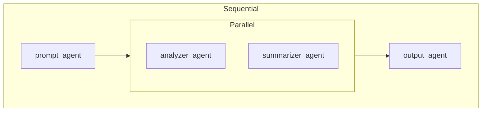

# CLI Commands Reference

Complete reference for all CLI commands.

## adkflow

Main CLI for development server management.

### adkflow dev

Start both backend and frontend in development mode with hot reload.

```bash
adkflow dev [OPTIONS]
```

**Options:**

| Option | Short | Default | Description |
|--------|-------|---------|-------------|
| `--backend-port` | `-b` | `6000` | Backend server port |
| `--frontend-port` | `-f` | `6006` | Frontend server port |

**Examples:**

```bash
# Default ports
adkflow dev

# Custom ports
adkflow dev --backend-port 8000 --frontend-port 3000
adkflow dev -b 8000 -f 3000
```

**Behavior:**
- Starts backend with uvicorn in reload mode
- Starts frontend with Next.js dev server
- Streams logs from both servers with prefixes `[BE]` and `[FE]`
- Press `Ctrl+C` to stop both servers

---

### adkflow start

Start both servers in production mode.

```bash
adkflow start [OPTIONS]
```

**Options:**

| Option | Short | Default | Description |
|--------|-------|---------|-------------|
| `--backend-port` | `-b` | `6000` | Backend server port |
| `--frontend-port` | `-f` | `6006` | Frontend server port |
| `--build/--no-build` | | `--build` | Build frontend before starting |

**Examples:**

```bash
# Build and start
adkflow start

# Use existing build
adkflow start --no-build

# Custom ports
adkflow start -b 8000 -f 3000
```

---

### adkflow backend

Start only the backend server.

```bash
adkflow backend [OPTIONS]
```

**Options:**

| Option | Short | Default | Description |
|--------|-------|---------|-------------|
| `--port` | `-p` | `6000` | Server port |

**Examples:**

```bash
adkflow backend
adkflow backend --port 8000
```

---

### adkflow frontend

Start only the frontend server.

```bash
adkflow frontend [OPTIONS]
```

**Options:**

| Option | Short | Default | Description |
|--------|-------|---------|-------------|
| `--port` | `-p` | `6006` | Server port |
| `--backend-port` | `-b` | `6000` | Backend port to connect to |

**Examples:**

```bash
adkflow frontend
adkflow frontend --port 3000 --backend-port 8000
```

---

### adkflow stop

Stop any running ADKFlow servers.

```bash
adkflow stop
```

Kills:
- Backend processes (`python -m backend.src.main`)
- Frontend dev server (`next dev`)
- Frontend prod server (`next start`)

---

### adkflow setup

Set up the development environment.

```bash
adkflow setup
```

**Actions:**
1. Installs backend Python dependencies (via `uv` or `pip`)
2. Installs frontend Node.js dependencies (`npm install`)

---

## adkflow run

Execute an ADKFlow workflow.

```bash
adkflow run [PROJECT_PATH] [OPTIONS]
```

**Arguments:**

| Argument | Default | Description |
|----------|---------|-------------|
| `PROJECT_PATH` | `.` | Path to workflow project directory |

**Options:**

| Option | Short | Default | Description |
|--------|-------|---------|-------------|
| `--tab` | `-t` | `None` | Specific tab to run (default: all via teleporters) |
| `--input` | `-i` | `None` | Input JSON string |
| `--input-file` | `-f` | `None` | Path to input JSON file |
| `--callback-url` | `-c` | `None` | URL to POST execution events |
| `--verbose` | `-v` | `False` | Show tool results and thinking |
| `--quiet` | `-q` | `False` | Only show final result |
| `--timeout` | | `300` | Execution timeout in seconds |
| `--no-validate` | | `False` | Skip validation before execution |
| `--interactive/-I` | | `True` | Enable/disable user input prompts |

**Examples:**

```bash
# Run current directory
adkflow run .

# Run with input
adkflow run . --input '{"prompt": "Hello!"}'

# Run from JSON file
adkflow run . --input-file input.json

# Run specific tab
adkflow run . --tab main

# Verbose output
adkflow run . --verbose

# Quiet mode (only final output)
adkflow run . --quiet

# With webhook for events
adkflow run . --callback-url http://localhost:6006/api/events

# Non-interactive (for scripts)
adkflow run . --no-interactive
```

**Exit Codes:**

| Code | Meaning |
|------|---------|
| `0` | Completed successfully |
| `1` | Failed with error |
| `130` | Cancelled by user |

**Environment:**

The command loads `.env` from the workflow project directory:

```bash
# /path/to/project/.env
GOOGLE_API_KEY=your_key
```

---

## adkflow validate

Validate a workflow without executing.

```bash
adkflow validate [PROJECT_PATH] [OPTIONS]
```

**Arguments:**

| Argument | Default | Description |
|----------|---------|-------------|
| `PROJECT_PATH` | `.` | Path to workflow project directory |

**Options:**

| Option | Short | Default | Description |
|--------|-------|---------|-------------|
| `--format` | `-f` | `summary` | Output format: `summary`, `json`, `yaml` |

**Examples:**

```bash
# Human-readable summary
adkflow validate .

# JSON output (for automation)
adkflow validate . --format json

# YAML output
adkflow validate . --format yaml
```

**Checks:**
- Valid project structure (`manifest.json` with nodes, edges, tabs)
- Missing file references (prompts, tools, contexts)
- Cycles in sequential flow
- Invalid agent configurations
- Orphaned nodes

**JSON Output Schema:**

```json
{
  "valid": true,
  "errors": [],
  "warnings": ["Optional tool X not found"]
}
```

---

## adkflow-runner topology

Show the compiled agent topology.

```bash
adkflow-runner topology [PROJECT_PATH] [OPTIONS]
```

**Arguments:**

| Argument | Default | Description |
|----------|---------|-------------|
| `PROJECT_PATH` | `.` | Path to workflow project directory |

**Options:**

| Option | Short | Default | Description |
|--------|-------|---------|-------------|
| `--format` | `-f` | `ascii` | Output format: `ascii`, `mermaid` |

**Examples:**

```bash
# ASCII art diagram
adkflow-runner topology .

# Mermaid diagram (for docs)
adkflow-runner topology . --format mermaid
```

**ASCII Output:**

```
┌─────────────────────────────┐
│       SequentialAgent       │
├─────────────────────────────┤
│  1. prompt_agent            │
│  2. ┌─────────────────────┐ │
│     │   ParallelAgent     │ │
│     ├─────────────────────┤ │
│     │ • analyzer_agent    │ │
│     │ • summarizer_agent  │ │
│     └─────────────────────┘ │
│  3. output_agent            │
└─────────────────────────────┘
```

**Mermaid Output:**



---

## Global Options

These options work with all commands:

| Option | Description |
|--------|-------------|
| `--version` | Show version and exit |
| `--help` | Show help message and exit |

```bash
adkflow --version
adkflow --help
adkflow run --help
```

## See Also

- [CLI Overview](./README.md) - Quick start
- [Running Workflows](../../user-manual/running-workflows.md) - User guide
- [Execution Engine](../backend/execution-engine.md) - How execution works
