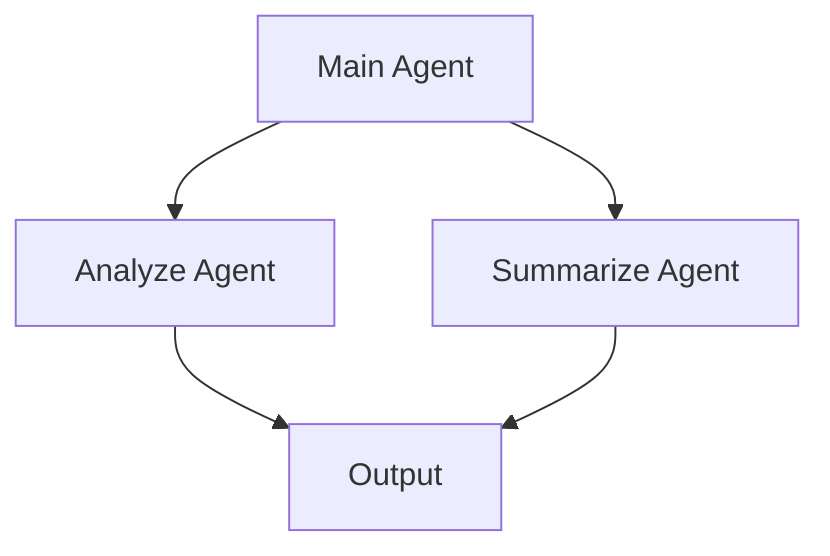

# Validation

Validating workflows and viewing topology.

## Workflow Validation

### What is Validated?

ADKFlow checks your workflow for:

| Check | Description |
|-------|-------------|
| **Required fields** | All required configuration is set |
| **Required connections** | Mandatory inputs are connected |
| **Type compatibility** | Connected types are compatible |
| **Agent hierarchy** | Parent-child relationships are valid |
| **Circular dependencies** | No infinite loops |

### Running Validation

#### Automatic

Validation runs automatically:
- When you try to run a workflow
- When you save (for warnings display)

#### Manual

**Workflow → Validate** to run validation explicitly.

### Validation Results

After validation, a dialog shows:

```
┌─────────────────────────────────────────────────────────────┐
│ Validation Results                                    [×]   │
├─────────────────────────────────────────────────────────────┤
│ ⚠ Warnings (2)                                              │
│   • analyze_agent: Model not specified, using default       │
│   • prompt_1: No connections from output                    │
│                                                             │
│ ✗ Errors (1)                                                │
│   • summarize_agent: Required input 'text' not connected   │
│                                                             │
│                                              [Run Anyway]    │
└─────────────────────────────────────────────────────────────┘
```

### Error Types

#### Errors (Red)

Must be fixed before running:
- Missing required connections
- Missing required configuration
- Invalid references

#### Warnings (Yellow)

Can be ignored but may cause issues:
- Unused nodes
- Default values being used
- Potential type mismatches

### Node Indicators

Nodes with issues show indicators:
- **Yellow triangle**: Warning
- **Red circle**: Error

Click the node to see details.

## Topology View

### What is Topology?

The topology view shows your workflow as a graph:
- Agent hierarchy
- Execution flow
- Dependencies

### Opening Topology

**Workflow → Show Topology**

### View Formats

#### Mermaid Diagram

Interactive flowchart:



#### ASCII Diagram

Text-based representation:

```
Main Agent
├── Analyze Agent
│   └── Output
└── Summarize Agent
    └── Output
```

### Using Topology

The topology view helps you:
- Understand workflow structure
- Identify execution order
- Debug dependency issues
- Document your workflow

## Fixing Issues

### Missing Connections

1. Find the node with the error
2. Check which input is required
3. Connect an appropriate source

### Missing Configuration

1. Click the node
2. Find the empty required field
3. Enter a valid value

### Type Mismatches

1. Check the connection
2. Verify source type matches accepted types
3. Add a conversion node if needed

### Circular Dependencies

1. Identify the cycle in topology
2. Remove one connection in the loop
3. Use a different pattern (e.g., teleporters)

## Best Practices

### Validate Often

- Validate before running
- Validate after major changes
- Fix errors immediately

### Use Warnings

Warnings often indicate:
- Unused work
- Potential issues
- Areas to review

### Document

Use the topology view to:
- Create documentation
- Share workflow design
- Review before deployment

## See Also

- [Running Workflows](./running-workflows.md) - Execution after validation
- [Connections](./connections.md) - Connection requirements
- [Nodes](./nodes.md) - Node configuration
